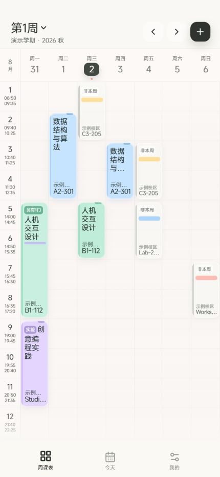
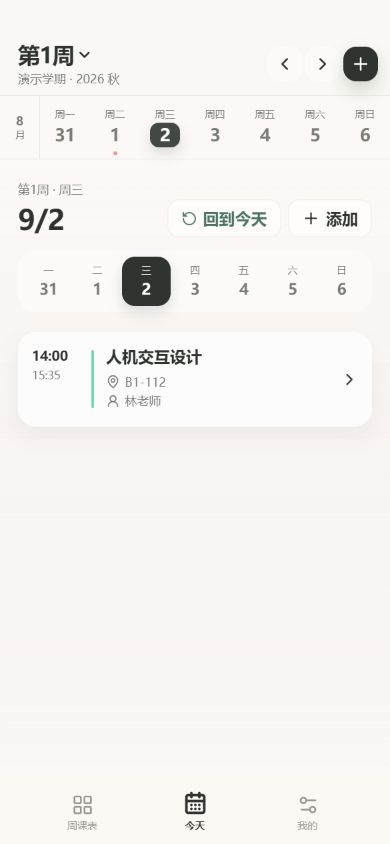
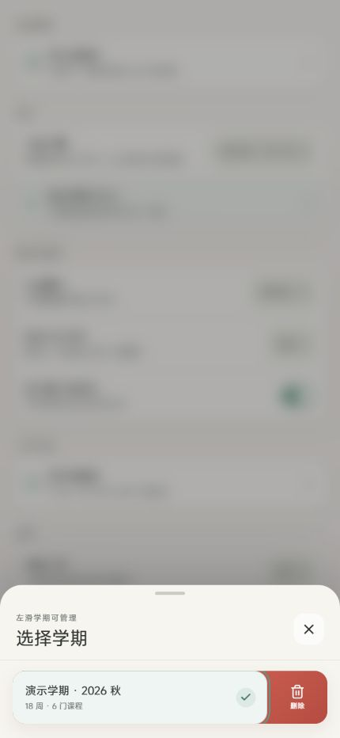
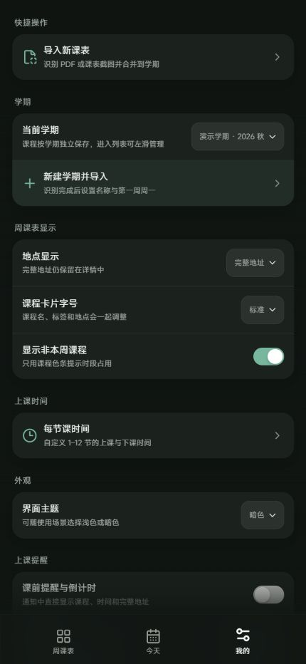
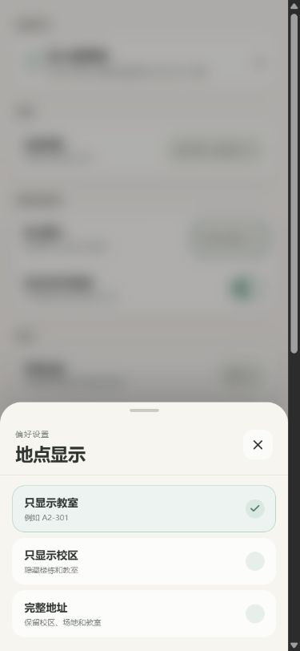

<p align="center">
  
</p>

<h1 align="center">KeXu</h1>

<p align="center">一个不需要账号、没有广告、课程数据默认留在本机的 Android 课表。</p>

<p align="center">
  <a href="https://github.com/PoesisQ/KeXu/releases/latest"></a>
  <a href="https://github.com/PoesisQ/KeXu/actions/workflows/ci.yml"></a>
  
</p>

<p align="center">
  <strong><a href="https://github.com/PoesisQ/KeXu/releases/latest">下载最新 APK</a></strong>
  ·
  <a href="https://github.com/PoesisQ/KeXu/releases">查看更新记录</a>
</p>

## KeXu 能做什么

KeXu 把课表导入、日常查看、临时修改和课前提醒放在一个应用里。学校只提供 PDF、截图或 Excel 也可以导入；识别结果会先进入预览，不会未经确认直接写进课表。

| 功能 | 具体内容 |
| --- | --- |
| 看课表 | 周课表与单日视图；左右滑动换周或换日；快速回到本周、今天 |
| 导入 | PDF、图片、Excel、CSV、Word、TXT、Markdown、JSON；连续截图可分次追加 |
| 修改 | 可只改本周一次、从某周起、本安排或整门课 |
| 管理学期 | 新建、切换、左滑删除；可修正第一周周一并同步平移课程计划 |
| 提醒 | Android 课前通知，显示课程、时间和完整地点；提醒分钟数可调 |
| 自定义 | 浅色/暗色主题、壁纸、课程字号、地址显示方式和每节课时间 |
| 数据 | 本地保存，支持导出完整 JSON 备份 |

## 日常课表

- 周课表和日期会跟随手势同步移动，左侧节次与时间保持固定。
- 同一时段有多门课或非本周课程时，先用颜色条表示；点开后再查看完整列表。
- 支持 1–12 节课程，可在“我的 → 每节课时间”中按照学校作息分别调整每节课的上课与下课时间。
- 课程卡片字号有紧凑、标准和较大三档；地址可显示完整地址、仅校区或仅教室。
- 点击空白节次可以添加课程，点击课程进入详情。

<p align="center">
  
  &nbsp;&nbsp;
  
</p>

## 课表导入

### 支持的文件

- PDF：优先读取文本层，扫描版可使用本地 OCR 或可选的视觉识别。
- 图片：PNG、JPG、WebP 等；最多 8 张联合识别，也可以一次追加一张。
- 表格：XLSX、XLS、XLSM、XLSB、ODS、CSV、TSV。
- 文档：DOCX、TXT、Markdown、JSON、LOG。旧版 DOC 需先另存为 DOCX。

### 两种识别方式

**免费本地解析**不需要 API Key。表格、Word、文本和带文本层的 PDF 会直接读取结构；图片和扫描 PDF 使用本地 OCR。

**DeepSeek 版面识别**是可选项，需要用户自己的 API Key。它主要用于版面复杂的截图、连续长图和带表格的 Word 文档；Word 会保留表格布局渲染为页面后交给视觉模型，而不是压成纯文本。只有主动选择此模式时才会调用网络模型。

无论使用哪种方式，导入后都会先显示课程名、教师、星期、节次、周次和地点供检查。同一课程在多个星期上课，或同时包含理论、实验和实践时，会保存为一门课程下的多个安排，方便统一修改颜色和地点。

> 不同学校的课表格式差异很大。保存前请重点检查周次、实验课、晚间课程和跨页内容。

## 修改课程与管理学期

- **仅本次**：只改变当前周的这一节课。
- **从当前周起**：保留之前安排，从这一周开始使用新内容。
- **本安排**：修改该星期、节次和周次组合。
- **整门课**：可把地点等信息同步到这门课的全部安排。

学期之间的数据彼此独立。导入时可以合并到已有学期，也可以建立新学期；在学期选择面板左滑某一项即可显示删除按钮，确认后才会真正删除。若第一周周一设置有误，可在“我的”中修改，课程周次与考试、答辩等日期会一起平移，无需重新导入。

<p align="center">
  
</p>

## 提醒与外观

Android 版可以在上课前指定分钟数发送通知，内容包括课程、时间和完整地址。设置页提供测试通知、系统权限入口和后台限制检查；更改课程、作息时间或提醒设置后会重新安排通知。

vivo / OriginOS 是否将通知显示在原子岛、锁屏或其他系统区域，由具体机型、系统版本和通知策略决定。

壁纸支持适应、填充、宽度适配、拉伸、位置、缩放、亮度、模糊和 `5%–100%` 可见度。界面提供浅色与暗色主题，选择面板和编辑页面使用统一样式。

<p align="center">
  
  &nbsp;&nbsp;
  
</p>

以上截图使用虚构演示数据，不包含真实姓名、账号或 API Key。

## 下载与升级

当前版本：`0.9.22`

1. 前往 [GitHub Releases](https://github.com/PoesisQ/KeXu/releases/latest)。
2. 下载 `KeXu-v*.apk`，在 Android 手机上打开并安装。
3. 首次使用提醒功能时，按照设置页提示授予通知、闹钟和后台运行权限。

`0.9.16` 及之后的官方 APK 使用同一证书，可以直接覆盖升级。若从更早的异签名版本升级时出现“开发者签名冲突”，请先在旧版中导出完整备份，再卸载旧包并安装新版。

## 数据与隐私

- 课程、设置、壁纸和 API Key 保存在应用本地，不需要注册账号。
- 免费本地解析不会上传课表文件。
- 只有填写 API Key 并主动选择 DeepSeek 版面识别或校对时，相关图片、Word 渲染页面或待校对文本才会发送给模型服务。
- 导出的 JSON 可能包含课程、教师和教室信息，请自行妥善保管。
- API Key 保存在本地 WebView 存储中，并非硬件级加密保险库，不建议在共享设备中保存私人 Key。

<details>
<summary><strong>开发、构建与项目结构</strong></summary>

### 技术栈

- React 18、Vite 6、Capacitor 7
- Vitest
- PDF.js、Tesseract.js
- SheetJS、Mammoth.js
- Android Java、AlarmManager

PDF、OCR、Excel 和 Word 解析器采用动态导入，只在导入课表时加载，不进入日常查看课表的首屏路径。

### 本地运行

环境要求：Node.js 20 或更高版本。

```bash
npm ci
npm run dev
```

完整质量检查：

```bash
npm run check
```

该命令会运行单元测试、Android/UI 静态适配守卫和生产构建。

### Android 构建

```bash
npm run android:sync
cd android
./gradlew assembleDebug
```

APK 默认位于 `android/app/build/outputs/apk/debug/app-debug.apk`。仓库不包含发布私钥；自行构建 release APK 时，需要配置自己的 `android/signing.properties`。

### 主要目录

```text
KeXu/
├─ android/                 # Capacitor Android 工程与提醒插件
├─ docs/screenshots/        # README 页面截图
├─ public/                  # 图标、PDF 字体与 CMap 资源
├─ scripts/                 # Android 资源生成与适配检查
└─ src/
   ├─ App.jsx               # 页面与业务编排
   ├─ importer.js          # PDF、OCR 与识别结果整理
   ├─ documentImporter.js  # Excel、Word 与文本读取
   ├─ reminders.js         # 提醒数据与原生桥接
   ├─ schedule.js          # 周次、日期和课程合并逻辑
   └─ storage.js           # 本地持久化与数据迁移
```

### Android 权限

| 权限 | 用途 |
| --- | --- |
| `POST_NOTIFICATIONS` | 显示课前通知 |
| `SCHEDULE_EXACT_ALARM` | 尽量准确地在课前触发提醒 |
| `RECEIVE_BOOT_COMPLETED` | 重启后恢复提醒 |
| `VIBRATE` | 通知振动 |
| `INTERNET` | 可选模型请求和首次 OCR 资源下载 |

</details>

## 贡献

提交修改前请运行 `npm run check`。涉及导入器时，请提供去标识化的最小样例和对应测试；不要提交真实 API Key、完整个人课表或 APK。

## 许可证

仓库目前尚未附加开源许可证，默认保留所有权利。
